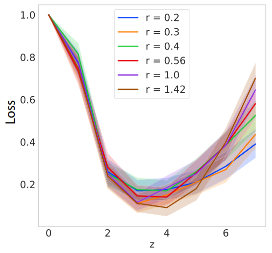

# Logic-and-Learning-in-Network-Cascades
 <figure>
    

        
    

    <figcaption>
        Treating the Linear Threshold Model as a classification model, where global cascades are the output gives us a loss function = 1 - cascade frequency. 
        <a href="https://www.cambridge.org/core/journals/network-science/article/logic-and-learning-in-network-cascades/B89A3EB13FF6F1719482D38F11E37068" target="_blank">Source</a>
    </figcaption> 
</figure>

  

This is a repository of code to support the submitted journal publication: "Logic and Learning in Network Cascades".

**Requires python version 3.6.5**

## Abstract

Critical cascades are found in many self-organizing systems. Here we examine critical cascades as a design paradigm for logic and learning under the Linear Threshold Model (LTM), and simple biologically-inspired variants of it as sources of computational power, learning efficiency, and robustness. First, we show that the LTM can compute logic, and with a small modification, universal Boolean logic, examining its stability and cascade frequency. We then frame it formally as a binary classifier and remark on implications for accuracy. Second, we examine the LTM as a statistical learning model, studying benefits of spatial constraints and criticality to efficiency. We also discuss implications for robustness in information encoding. Our experiments show that spatial constraints can greatly increase efficiency. Theoretical investigation and initial experimental results also indicate that criticality can result in a sudden increase in accuracy.

**Keywords:** cascades·criticality·percolation·influence maximization·network rewiring·neuronal avalanches·statistical learning·linear threshold model·universal Boolean logic·complex networks

## Files:

- `Effects of Radius in ER 2-D network.ipynb`: [Description of this file]
- `effects_radius_params_results_100_200_50_#3.pkl`: [Description of this file]
- `GlobalCascadeNetwork.py`: [Description of this file]
- `latest_experiment_choices3.csv`: [Description of this file]
- `README.md`: This file

## Paper:

For more detailed information, please refer to our paper:

[Logic and Learning in Network Cascades](https://www.cambridge.org/core/journals/network-science/article/logic-and-learning-in-network-cascades/B89A3EB13FF6F1719482D38F11E37068)

## Citation Request

If you use this code or our findings in your research, please cite our paper:

Wilkerson, G. J., & Moschoyiannis, S. (2021). Logic and learning in network cascades. Network Science, 9(S1), S157-S174.
